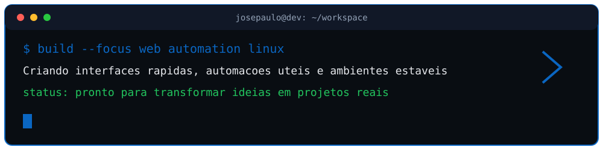
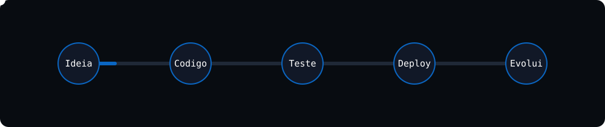

<p align="center">
  
</p>

<p align="center">
  
</p>

<p align="center">
  <a href="https://git.io/typing-svg">
    
  </a>
</p>

<p align="center">
  <a href="mailto:josepaulo20030502@gmail.com">
    
  </a>
  <a href="https://www.linkedin.com/in/jos%C3%A9-paulo-a255a6374/">
    
  </a>
  <a href="https://github.com/JosePaulo2003">
    
  </a>
</p>

<p align="center">
  
  
  
</p>

<p align="center">
  
</p>

## Sobre mim

Sou freelancer focado em **desenvolvimento web**, **automacao** e **infraestrutura leve**.

Gosto de criar solucoes diretas, rapidas e faceis de manter, com foco em codigo limpo, estabilidade e boa experiencia para o usuario.

<p align="center">
  
</p>

```txt
> clareza antes de complexidade
> performance antes de excesso
> solucao real antes de enfeite
```

<p align="center">
  <a href="https://git.io/typing-svg">
    
  </a>
</p>

---

## Como posso ajudar

<table>
  <tr>
    <td width="50%">
      <h3 align="center">Web</h3>
      <p align="center">Sites, sistemas, landing pages, interfaces responsivas e projetos sob medida.</p>
    </td>
    <td width="50%">
      <h3 align="center">Automacao</h3>
      <p align="center">Scripts em Python, rotinas automaticas, integracoes simples e processos mais rapidos.</p>
    </td>
  </tr>
  <tr>
    <td width="50%">
      <h3 align="center">Servidores</h3>
      <p align="center">Configuracao Linux, deploy, seguranca basica, performance e manutencao.</p>
    </td>
    <td width="50%">
      <h3 align="center">Freelancer</h3>
      <p align="center">Solucoes praticas para negocios, profissionais e ideias em desenvolvimento.</p>
    </td>
  </tr>
</table>

<p align="center">
  
</p>

---

## Tecnologias

<p align="center">
  
</p>

<p align="center">
  
</p>

<p align="center">
  
  
  
  
  
</p>

---

## Projetos em destaque

Projetos desenvolvidos para controle interno, organizacao de processos, automacao de infraestrutura e apoio operacional.

| Projeto | Descricao | Tecnologias |
|---|---|---|
| [Gestao de Itens / Almoxarifado](https://github.com/JosePaulo2003/gestao-itens) | Sistema para cadastro de itens, estoque, relatorios, solicitacoes, emprestimos, devolucoes e controle de bloqueios por regras de uso. | PHP, MySQL, HTML, CSS, JavaScript |
| [Sistema de Portaria CTIC](https://github.com/JosePaulo2003/sistema-portaria-ctic) | Sistema para controle de portaria, reservas de salas, retirada/devolucao de chaves, permissoes, usuarios, logs e advertencias. | PHP, MySQL, MVC, JavaScript |
| [Sistema Interno CTIC](https://github.com/JosePaulo2003/sistema-interno-ctic) | Painel interno com autenticacao, gestao de usuarios, perfil com avatar e modulo de presenca de estagiarios por turma. | PHP, MySQL, HTML, CSS |
| [Scripts de Servidor](https://github.com/JosePaulo2003/scripts-servidor) | Scripts para instalacao do Coolify, diagnostico de rede/servidor e criacao de usuarios SSH em ambientes Linux. | Bash, Linux, Docker, SSH |

<p align="center">
  <a href="https://git.io/typing-svg">
    
  </a>
</p>

---

## Estatisticas

<p align="center">
  
</p>

<p align="center">
  
</p>

<p align="center">
  
</p>

<p align="center">
  
  
</p>

---

## Contato

<p align="center">
  
</p>

<p align="center">
  <a href="mailto:josepaulo20030502@gmail.com">
    
  </a>
  <a href="https://www.linkedin.com/in/jos%C3%A9-paulo-a255a6374/">
    
  </a>
</p>

<p align="center">
  <a href="https://git.io/typing-svg">
    
  </a>
</p>

<p align="center">
  
</p>
